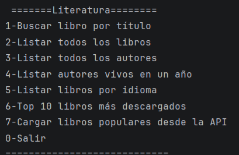
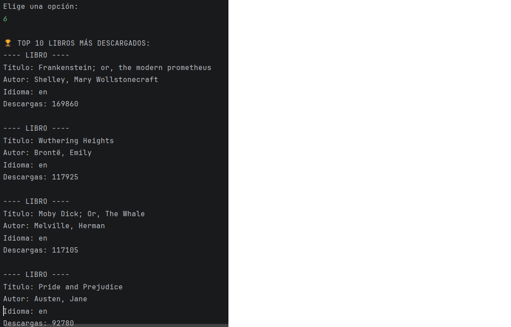
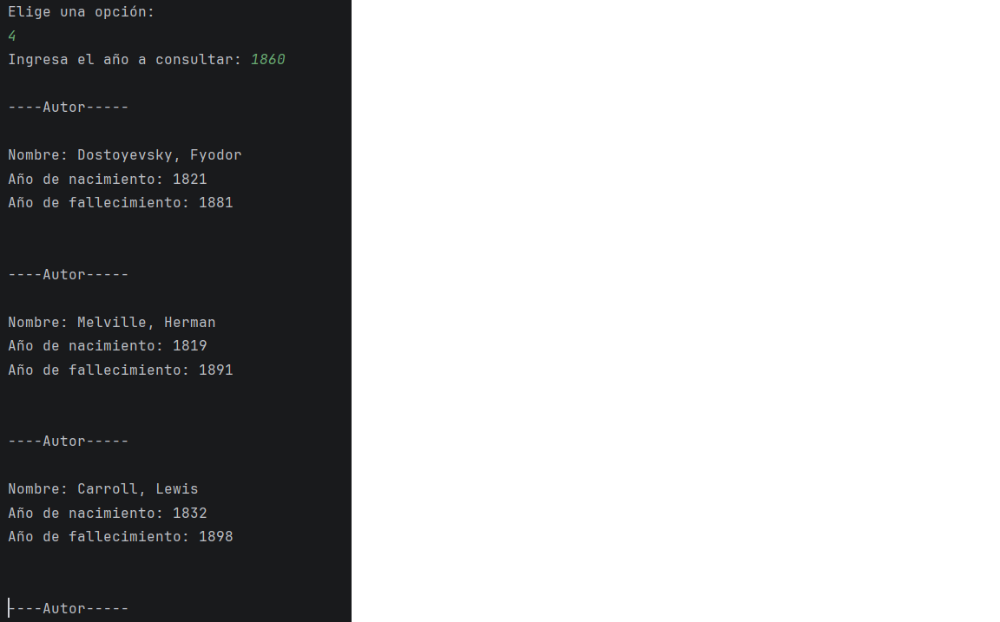
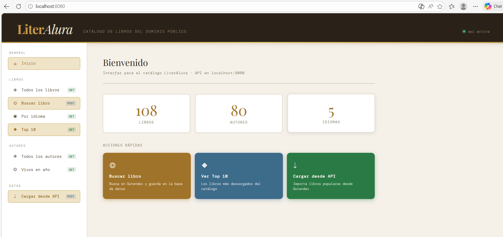
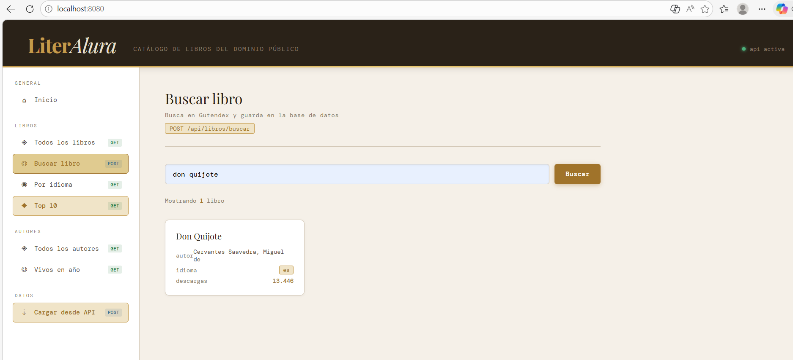
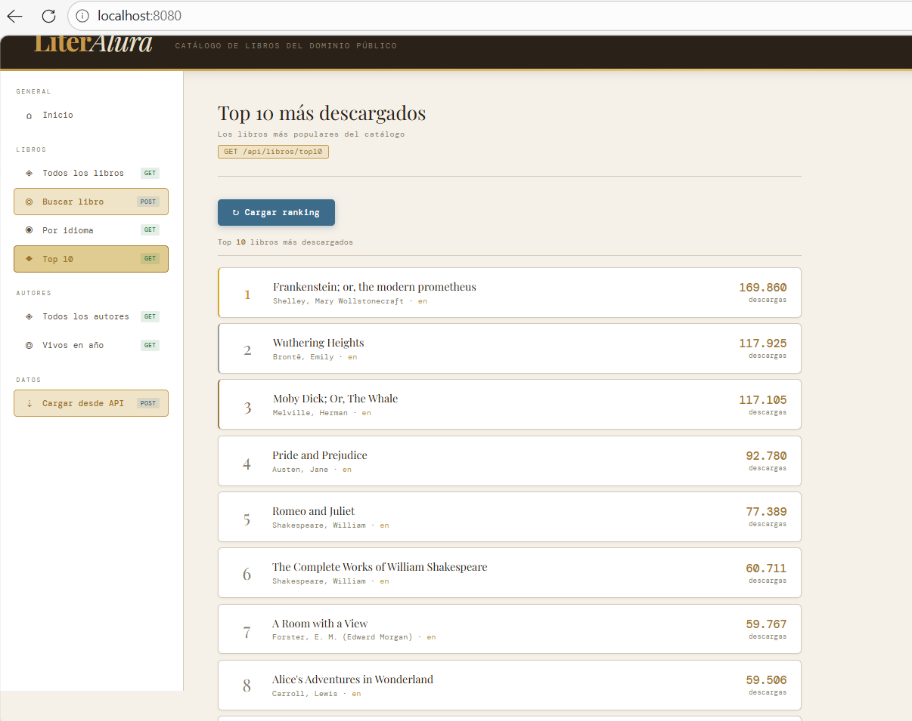
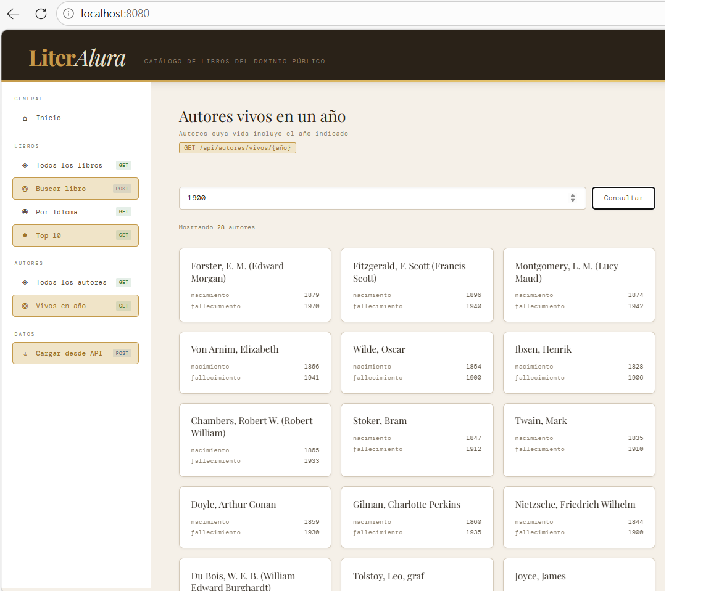
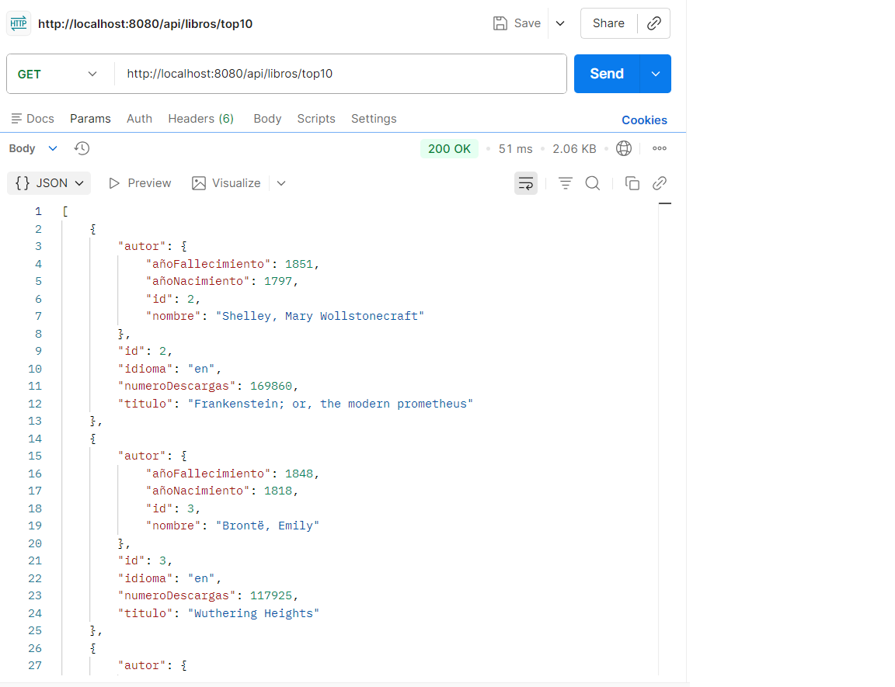
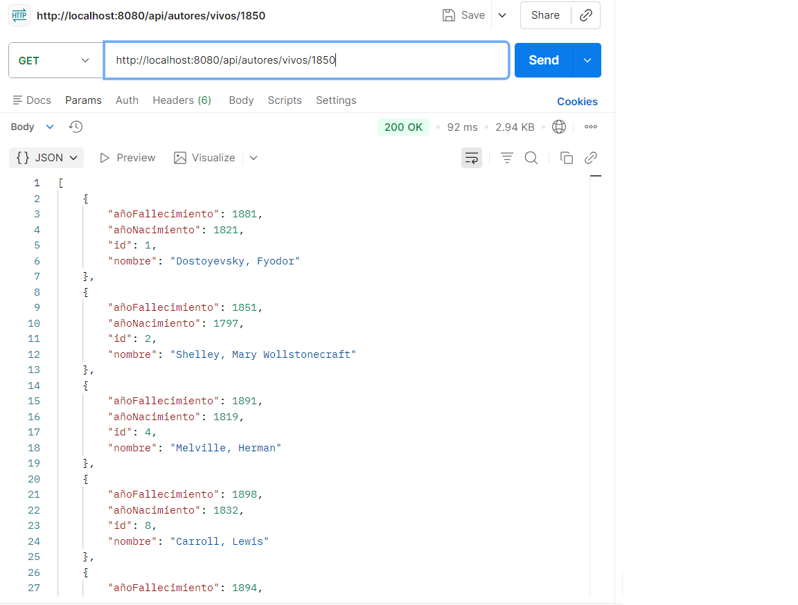
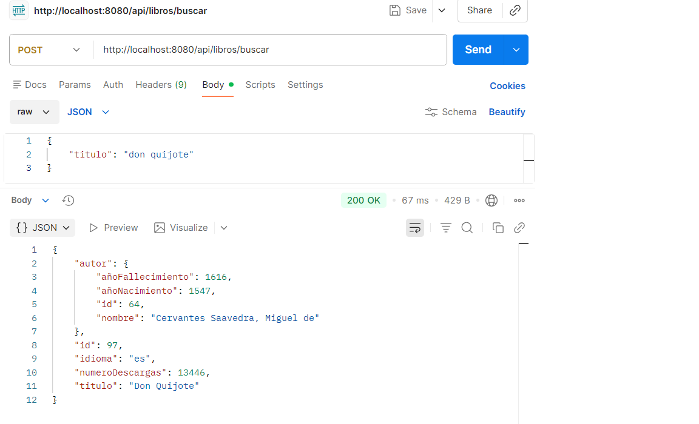

# LiterAlura 📚

Catálogo de libros del dominio público construido con **Spring Boot**, consumiendo la API de [Gutendex](https://gutendex.com/). Permite buscar, registrar y consultar libros y autores desde una interfaz de consola, una API REST y un frontend web.

---

## Tabla de contenidos

- [Tecnologías](#tecnologías)
- [Funcionalidades](#funcionalidades)
- [Configuración](#configuración)
- [Cómo ejecutar](#cómo-ejecutar)
- [Frontend](#frontend)
- [Endpoints REST](#endpoints-rest)
- [Estructura del proyecto](#estructura-del-proyecto)
- [Capturas](#capturas)
- [Autor](#autor)

---

## Tecnologías

- Java 25 · Spring Boot 4.0.3
- Spring Data JPA · Hibernate 7.2.4
- PostgreSQL 18
- Jackson · Maven
- HTML / CSS / JavaScript (frontend standalone)

---

## Funcionalidades

| # | Función | Consola | API REST | Frontend |
|---|---------|:-------:|:--------:|:--------:|
| 1 | Buscar libro por título | ✅ | ✅ | ✅ |
| 2 | Listar todos los libros | ✅ | ✅ | ✅ |
| 3 | Listar todos los autores | ✅ | ✅ | ✅ |
| 4 | Autores vivos en un año | ✅ | ✅ | ✅ |
| 5 | Libros por idioma | ✅ | ✅ | ✅ |
| 6 | Top 10 más descargados | ✅ | ✅ | ✅ |
| 7 | Carga masiva desde API | ✅ | ✅ | ✅ |

---

## Configuración

### Requisitos

- Java 21+
- PostgreSQL
- Maven

### Variables de entorno

Crea un archivo `.env` basado en `.env.example`:

```env
DB_URL=jdbc:postgresql://localhost:5432/literalura
DB_USERNAME=tu_usuario
DB_PASSWORD=tu_password
SPRING_PROFILE=dev
```

Configura estas variables en **IntelliJ → Run → Edit Configurations → Environment variables**.

### Perfiles

- `dev` — muestra SQL en consola, logs detallados
- `prod` — silencioso, solo errores

---

## Cómo ejecutar

### 1. Iniciar la aplicación

```bash
mvn spring-boot:run
```

La app inicia el menú de consola **y** el servidor REST simultáneamente.

### 2. Usar la consola

El menú interactivo aparece en la terminal. Escribe el número de la opción y presiona Enter.

### 3. Usar el frontend

Abre `http://localhost:8080` en el navegador. El frontend se sirve automáticamente desde Spring Boot.

### 4. Usar la API con Postman

Apunta las peticiones a `http://localhost:8080/api`.

---

## Frontend

Interfaz web incluida en la app, servida desde `localhost:8080`. Incluye:

- Panel de inicio con estadísticas en tiempo real (libros, autores, idiomas)
- Acciones rápidas: **Buscar libro**, **Ver Top 10**, **Cargar desde API**
- Navegación lateral con todas las funciones disponibles
- Indicador de estado de la API en tiempo real

---

## Endpoints REST

| Método | Endpoint | Descripción |
|--------|----------|-------------|
| GET | `/api/libros` | Todos los libros |
| GET | `/api/libros/idioma/{idioma}` | Libros por idioma (es, en, fr, pt, zh) |
| GET | `/api/libros/top10` | Top 10 más descargados |
| POST | `/api/libros/buscar` | Buscar y guardar libro por título |
| POST | `/api/libros/cargar` | Cargar libros desde Gutendex |
| GET | `/api/autores` | Todos los autores |
| GET | `/api/autores/vivos/{año}` | Autores vivos en un año dado |

### Ejemplo — Buscar libro

```http
POST /api/libros/buscar
Content-Type: application/json

{
    "titulo": "don quijote"
}
```

---

## Estructura del proyecto

```
src/main/java/com/example/literalura/
├── config/
│   └── CorsConfig.java
├── controller/
│   ├── AutorController.java
│   └── LibroController.java
├── dto/
│   ├── DatosAutor.java
│   ├── DatosLibro.java
│   └── DatosResultados.java
├── model/
│   ├── Autor.java
│   └── Libro.java
├── principal/
│   └── Principal.java
├── repository/
│   ├── AutorRepository.java
│   └── LibroRepository.java
├── service/
│   ├── AutorService.java
│   ├── GutendexClient.java
│   └── LibroService.java
└── LiterAluraApplication.java
```

---

## Capturas

### Consola — Menú principal


### Consola — Búsqueda de libro


### Consola — Top 10 más descargados


### Consola — Autores vivos en un año


### Frontend — Inicio con estadísticas


### Frontend — Búsqueda de libro


### Frontend — Top 10 más descargados


### Frontend — Autores vivos en un año


### API REST — GET /api/libros/top10 (Postman)


### API REST — GET /api/autores/vivos/{año} (Postman)


### API REST — POST /api/libros/buscar (Postman)


---

## Autor

**Daniel Sepúlveda M** · Challenge Backend — Oracle Next Education + Alura Latam
